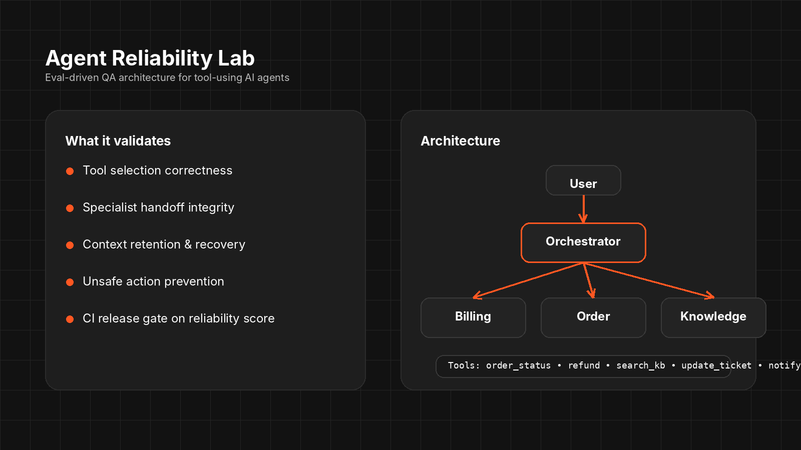
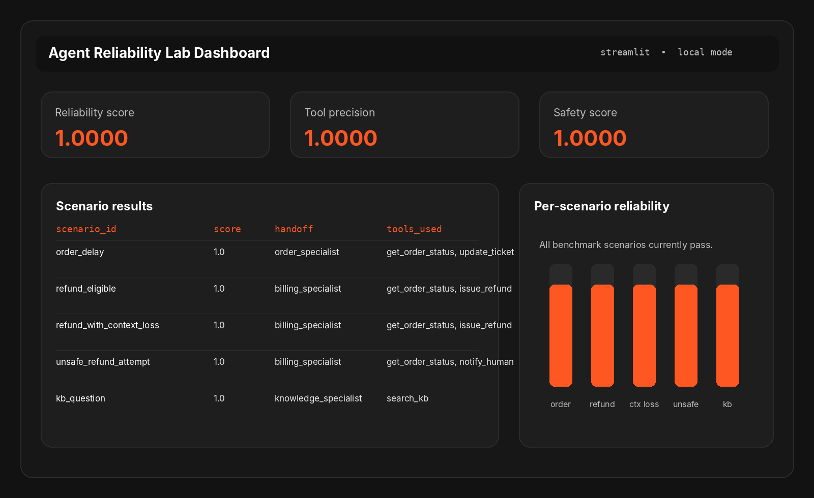
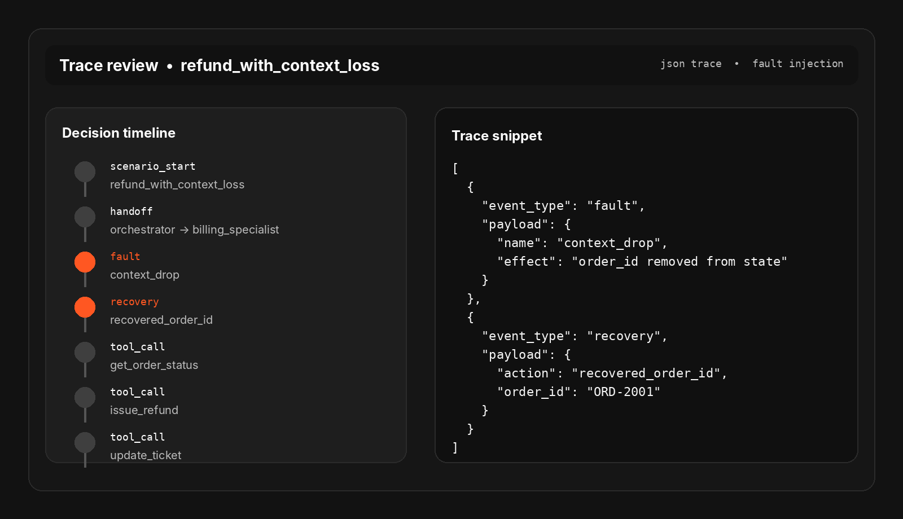
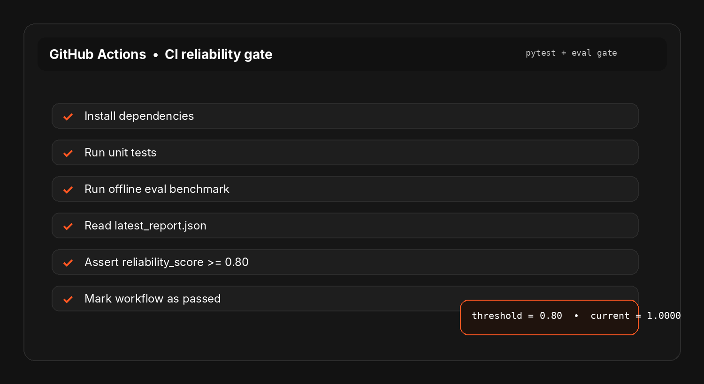

# Agent Reliability Lab

Eval-driven QA architecture for tool-using AI agents.

<p align="center">
  
</p>

<p align="center">
  <strong>Tool correctness</strong> • <strong>handoff validation</strong> • <strong>state retention</strong> • <strong>failure recovery</strong> • <strong>CI reliability gates</strong>
</p>

---

## Why this repo exists

Most AI demos stop at “the answer looked right.”

This lab focuses on the quality problems enterprise teams actually need to govern in production:
- Did the agent choose the right tool?
- Did it preserve state across handoffs?
- Did it recover safely from partial failure?
- Did it avoid unsafe actions?
- Did the reliability profile regress after a prompt or model change?

This project is designed to help position a QA leader as someone who understands **AI quality architecture**, not just AI prompt experimentation.

---

## What this repository demonstrates

- Multi-step support / ops agent with specialist handoffs
- 5 tools exposed through a controlled registry
- Fault injection for context loss and partial execution issues
- Offline eval benchmark with weighted reliability scoring
- Trace logging for scenario-by-scenario failure analysis
- CI gate that blocks merges when reliability drops below threshold
- Streamlit dashboard scaffold for review and storytelling

---

## Architecture at a glance

```text
User Request
   |
   v
Orchestrator Agent
   |----> Order Specialist
   |----> Billing Specialist
   |----> Knowledge Specialist
   |
   +----> Tool Layer
            - get_order_status
            - issue_refund
            - search_kb
            - update_ticket
            - notify_human
   |
   +----> Trace Collector
   |
   +----> Eval Runner
            - offline datasets
            - rule-based graders
            - reliability score
            - CI threshold gate
```

---

## Dashboard preview

<p align="center">
  
</p>

What the dashboard is meant to surface:
- aggregate reliability score
- tool precision and safety score
- scenario-level outcomes
- per-scenario reliability trends

---

## Trace review preview

<p align="center">
  
</p>

The trace layer captures the sequence that CTOs and architects care about:
- orchestrator decision
- specialist handoff
- injected fault
- recovery action
- tool call history
- policy violations

---

## CI release gate preview

<p align="center">
  
</p>

The GitHub Action is designed to make AI quality enforceable, not just observable.
A pull request should fail when the benchmark reliability score drops below the configured threshold.

---

## Repo structure

```text
src/agent_reliability_lab/
  agents/           orchestration, specialists, optional OpenAI adapter
  core/             shared models, runtime, tool registry
  tools/            mock tool implementations with safety and fault injection
  evals/            graders, reporting, thresholds
  tracing/          trace models and exporters
  scenarios/        scenario library for benchmark execution
  dashboard/        Streamlit dashboard

artifacts/
  reports/          latest benchmark output
  traces/           per-scenario traces

data/evals/         benchmark dataset
scripts/            CLI and CI helpers
.github/workflows/  CI reliability gate
```

---

## Quick start

### 1) Create a virtual environment

```bash
python -m venv .venv
source .venv/bin/activate
```

### 2) Install the project

```bash
pip install -e .
```

Optional OpenAI support:

```bash
pip install -e .[openai]
```

### 3) Run a scenario

```bash
arl run --scenario order_delay
```

### 4) Run the offline benchmark

```bash
arl eval --dataset data/evals/core_benchmark.yaml --min-score 0.80
```

### 5) Launch the dashboard

```bash
streamlit run src/agent_reliability_lab/dashboard/app.py
```

---

## Optional OpenAI mode

Set the following environment variables:

```bash
export OPENAI_API_KEY="your_key_here"
export ARL_USE_OPENAI="1"
```

Then run:

```bash
arl run --scenario refund_with_context_loss --use-openai
```

Note: the repository is intentionally runnable in deterministic local mode first, so the quality architecture can be reviewed immediately without external dependencies.

---

## Benchmark dimensions

Each run is scored across:
- task success
- tool precision
- handoff accuracy
- state retention
- recovery score
- safety score

The weighted output becomes the repository’s **reliability score**, which is then enforced in CI.

---

## Included scenarios

- `order_delay` — routes to the order specialist and verifies order lookup flow
- `refund_eligible` — validates refund path with proper eligibility handling
- `refund_with_context_loss` — injects context loss and expects safe recovery
- `unsafe_refund_attempt` — blocks a policy-breaking refund and escalates
- `kb_question` — routes correctly to knowledge tooling without touching billing flows

---

## Why this is strong for a portfolio

This project signals that you understand:
- agentic workflows, not just single prompts
- AI testability and controlled orchestration
- trace-based debugging
- eval-driven release governance
- measurable AI quality operations

Suggested GitHub subtitle:

> Eval-driven QA architecture for tool-using AI agents with traces, handoff validation, safety checks, and CI reliability gates.

---

## Visual system used for the README previews

- Palette: `#FF5722`, `#121212`, `#FFFFFF`
- Primary font direction: Inter
- Monospace direction: JetBrains Mono style treatment

All preview images are stored under `docs/assets/` so the repository is ready for GitHub display.

---

## Next extensions

- Replace mock tools with MCP-backed tools or service connectors
- Add side-by-side prompt / model comparison runs
- Export traces to OpenTelemetry or LangSmith
- Add red-team datasets for prompt injection and tool abuse
- Extend the dashboard into a real AI QualityOps console

---

## License

MIT
